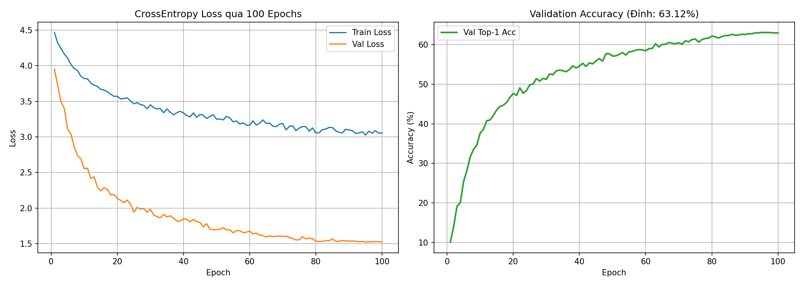

# CIFAR-100 Experiment Report: ResMLP with LocalPerceptron

## 1. Overview
- **Model**: ResMLP (8 Layers, Feature Dim 128, Expansion Factor 2)
- **Proposed Enhancement**: Integrated **Local Perceptron** (Parallel Conv 1x1 + Conv 3x3 branches with BatchNorm) and **Structural Re-parameterization** (Locality Injection into linear weights `fc1`).
- **Dataset**: CIFAR-100 (50,000 train images, 10,000 validation/test images, 100 classes)
- **Training Epochs**: 100
- **Batch Size**: 128
- **Optimizer**: AdamW (lr=1e-3, weight_decay=0.05, cosine scheduler)
- **Mixed Precision**: PyTorch AMP (FP16) on NVIDIA T4 GPU

---

## 2. Experimental Results (100 Epochs)

| Metric | Start (Epoch 1) | Mid (Epoch 50) | Final (Epoch 100) | Best |
| :--- | :---: | :---: | :---: | :---: |
| **Train Loss** | 4.466 | 3.248 | 3.055 | **3.051** |
| **Validation Loss** | 3.950 | 1.698 | 1.527 | **1.525** |
| **Validation Top-1 Acc** | 10.06% | 57.14% | 63.00% | **63.12%** |
| **Validation Top-5 Acc** | 30.50% | 83.94% | 87.28% | **87.54%** |

### Learning Curves:

---

## 3. Structural Re-parameterization & Speedup Benchmark

By applying **Locality Injection**, the multi-branch convolution perceptron used during training is converted via impulse-response into an equivalent $(S, S)$ linear weight matrix:

$$W_{\text{deploy}} = W_{\text{fc1}} + W_{1\times 1}^{(\text{equiv})} + W_{3\times 3}^{(\text{equiv})}$$

- **Numerical equivalence error**: $\Delta = 2.86 \times 10^{-6}$ (FP32)
- **Inference Speed**:
  - **Train mode (multi-branch conv)**: 18.74 ms / batch (1,707.3 img/s)
  - **Deploy mode (fused linear)**: **9.20 ms / batch (3,477.8 img/s)** $\implies$ **2.04x speedup** with zero extra FLOPs at inference.

---

## 4. Architecture Evolution Diagrams
- **Original ResMLP Block**: `reports/resmlp_figure1_recreated.png`
- **Upgraded RepMLP Architecture**: `reports/repmlp_architecture_upgraded.png`
- **Side-by-Side Comparison**: `reports/resmlp_to_repmlp_comparison.png`
